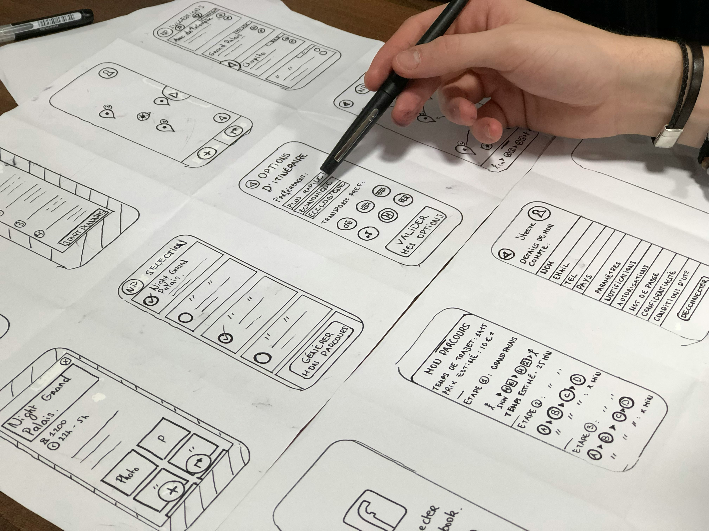
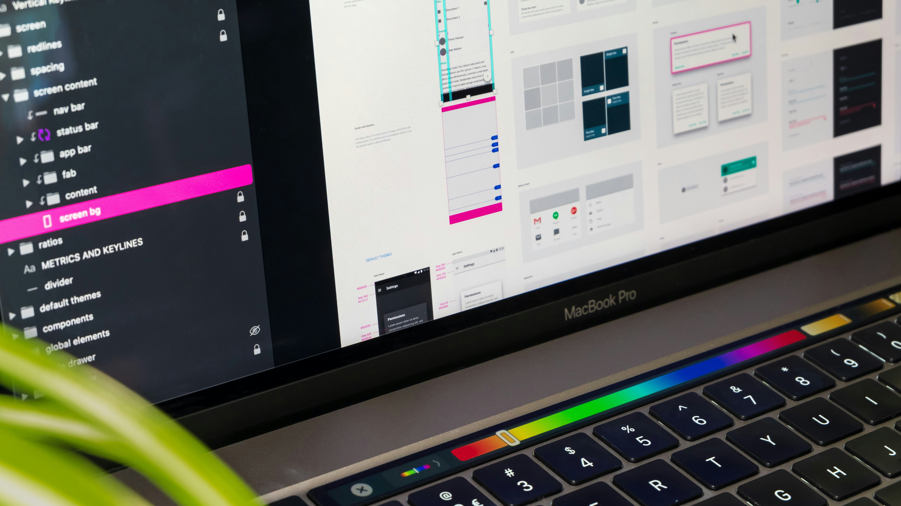


When interacting with a piece of software, user satisfaction levels can directly influence its success, and in turn, the
success of your business. If users encounter frustrations or difficulties, they’re likely to look for alternatives from
your competitors. So what elements should you prioritise to make sure this doesn’t happen? Here we explore the
significance of UI and UX in software design and how custom software development can give your brand a competitive edge.


## Understanding UI and UX

While UI (user interface) and UX (user experience) are distinct aspects of design, one can’t really exist without the
other. So what do they each involve?

UI design focuses on the visual elements of your software that users interact with directly, such as colour schemes,
button designs, and layout. UX design, on the other hand, encompasses the entire user journey and how it makes them
feel, involving user research, personas, and ensuring accessibility. Together, they create software that’s both visually
appealing and functionally superior.

## UI/UX in modern software development

We can’t stress enough the impact of UI/UX design on software development. It goes beyond mere aesthetics, playing a
crucial role in the overall success of a digital product.

### Enhancing user satisfaction

A well-thought-out UI/UX design can significantly increase user satisfaction. By creating intuitive interfaces and
smooth user journeys, software becomes more enjoyable to use, leading to higher user retention rates.

### Improving accessibility

UX design is also a key player in ensuring software is accessible to all users, including those with disabilities.
Considering diverse user needs during the design phase will mean that your software application is inclusive and usable
by the widest possible audience.

### Boosting brand recognition

Consistent and memorable UI/UX design helps in building strong brand recognition. When users have positive experiences
with your software, they’re more likely to associate your brand with quality and reliability. What's more, having strong
brand guidelines in place makes your business more recognisable in the marketplace.

The role of UI/UX influences everything, from user engagement to conversion rates. As we move into an increasingly
digital world, the importance of thoughtful UI/UX design in software development will only continue to grow.

## The power of custom UI/UX

When choosing a piece of software for your business, you'll come across both custom and off-the-self UI/UX design. While
the latter is ready to use as it is made for the mass market, bespoke options are designed specifically with your
business in mind. Both have their merits, but custom-built UI/UX software offers more key benefits, including:

**Aligning with your business goals:** Bespoke UI/UX design ensures that your software lines up with your business
objectives. It’s not necessarily about following trends, but about creating interfaces that work for your specific users
and business model. This is particularly useful if you run a more niche business.

**Giving you a competitive advantage:** In a world of template-based designs, a custom UI/UX can set your software apart
from the competition. It shows users that you value their experience enough to invest in a tailored interface, leading
to an increased ROI.

**Enhancing your brand recognition:** Custom UI/UX design allows for seamless integration of your brand elements into
the software, such as your unique logo, colour palette, fonts, and so on. This consistency across all touchpoints
strengthens brand recognition and recall, making your software a true extension of your brand identity.

## The bespoke UI/UX software design process

So how do digital agencies go about creating bespoke UI/UX software design? A typical design process begins with an
initial meeting to discover your goals and any specifics you require for your new piece of software. It's then left to
the designers to create detailed user flows and wireframes that will help you visualise the user journey and interface
layout before any coding begins. Once you are happy with the design, the development phase starts.

When considering an agency to build your bespoke software, look for those that emphasise a user-centric approach, for
example, by developing Single Page Applications (SPAs). These ensure smooth navigation and quick load times – important
elements that can essentially make or break your software's success.

## Wrapping up

In the competitive world of software development, excellent UI/UX design is not just a nice-to-have – it’s a necessity.
As a company handling custom UI and UX design services under one roof, [ainsley.dev](http://ainsley.dev) ensures a
cohesive process where design and functionality work in perfect harmony. This leads to more efficient project
management, faster turnaround times and better communication. So are you ready to elevate your software with top-notch,
bespoke UI/UX design? [Contact us today](https://ainsley.dev/contact/) for cutting-edge software development services to
suit your unique business needs.

## Useful links

* [UX in Software Development: A Practical Guide](https://brainhub.eu/guides/ux-in-software-development)
* [Importance of UI/UX design in Software Development](https://medium.com/@tobiegbude/importance-of-ui-ux-design-in-software-development-c21b342c2f12)
* [Why UX/UI Matters in Software Development](https://softwarethings.pro/blog/importance-of-ui-ux-design-in-software-development-business-guide)
